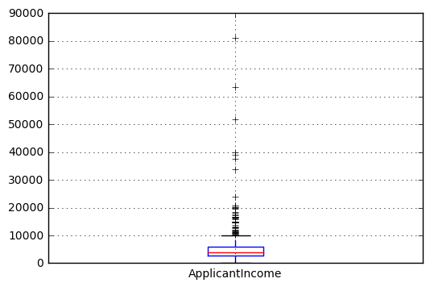
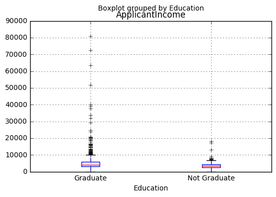
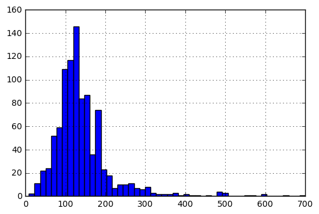
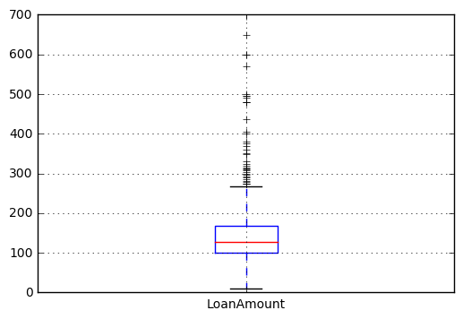
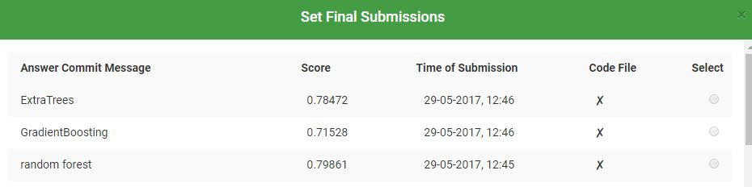
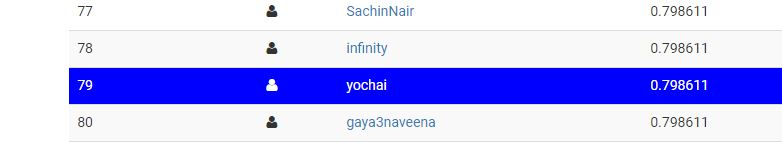

# HW4


```python
%pylab inline
import pandas as pd
import numpy as np
import matplotlib as plt
#Reading the dataset in a dataframe using Pandas
df = pd.read_csv("C:/Users/DELL/Desktop/study/year4/DataS/hw4/data/train.csv") 
test = pd.read_csv('C:/Users/DELL/Desktop/study/year4/DataS/hw4/data/test.csv')

x,_=df.shape
df_train=df
df = pd.concat([df,test])
```

    Populating the interactive namespace from numpy and matplotlib
    

# Distribution analysis

+ ApplicantIncome

plotting the histogram of ApplicantIncome


```python
df_train.boxplot(column='ApplicantIncome')
```

    C:\Users\DELL\Anaconda3\lib\site-packages\ipykernel\__main__.py:1: FutureWarning: 
    The default value for 'return_type' will change to 'axes' in a future release.
     To use the future behavior now, set return_type='axes'.
     To keep the previous behavior and silence this warning, set return_type='dict'.
      if __name__ == '__main__':
    


    {'boxes': [<matplotlib.lines.Line2D at 0x13063b31c88>],
     'caps': [<matplotlib.lines.Line2D at 0x13063b4bbe0>,
      <matplotlib.lines.Line2D at 0x13063b4bd68>],
     'fliers': [<matplotlib.lines.Line2D at 0x13063b569e8>],
     'means': [],
     'medians': [<matplotlib.lines.Line2D at 0x13063b52780>],
     'whiskers': [<matplotlib.lines.Line2D at 0x13063b319b0>,
      <matplotlib.lines.Line2D at 0x13063b41978>]}





This confirms the presence of a lot of outliers/extreme values

+ ApplicantIncome-Education


```python
df_train.boxplot(column='ApplicantIncome', by = 'Education')
```


    <matplotlib.axes._subplots.AxesSubplot at 0x13063ab9710>





We can see that there is no substantial different between the mean income of graduate and non-graduates. But there are a higher number of graduates with very high incomes, which are appearing to be the outliers.

+ LoanAmount

Plot the histogram and boxplot of LoanAmount


```python
df_train['LoanAmount'].hist(bins=50)
```


    <matplotlib.axes._subplots.AxesSubplot at 0x13063ac8be0>





```python
df_train.boxplot(column='LoanAmount')
```

    C:\Users\DELL\Anaconda3\lib\site-packages\ipykernel\__main__.py:1: FutureWarning: 
    The default value for 'return_type' will change to 'axes' in a future release.
     To use the future behavior now, set return_type='axes'.
     To keep the previous behavior and silence this warning, set return_type='dict'.
      if __name__ == '__main__':
    


    {'boxes': [<matplotlib.lines.Line2D at 0x130650af908>],
     'caps': [<matplotlib.lines.Line2D at 0x130650ba860>,
      <matplotlib.lines.Line2D at 0x130650ba9e8>],
     'fliers': [<matplotlib.lines.Line2D at 0x130650bfdd8>],
     'means': [],
     'medians': [<matplotlib.lines.Line2D at 0x130650bf400>],
     'whiskers': [<matplotlib.lines.Line2D at 0x130650afbe0>,
      <matplotlib.lines.Line2D at 0x130650b6f28>]}





there are some extreme values. Clearly, both ApplicantIncome and LoanAmount require some amount of data munging. LoanAmount has missing and well as extreme values values, while ApplicantIncome has a few extreme values, which demand deeper understanding.

# Categorical variable analysis

Frequency Table for Credit History:


```python
temp1 = df_train['Credit_History'].value_counts(ascending=True)
temp1
```


    0.0     89
    1.0    475
    Name: Credit_History, dtype: int64


Probability of getting loan for each Credit History class:


```python
temp2 = df_train.pivot_table(values='Loan_Status',index=['Credit_History'],aggfunc=lambda x: x.map({'Y':1,'N':0}).mean())
temp2
```


    Credit_History
    0.0    0.078652
    1.0    0.795789
    Name: Loan_Status, dtype: float64


```python
import matplotlib.pyplot as plt
temp3 = pd.crosstab(df_train['Credit_History'], df_train['Loan_Status'])
temp3.plot(kind='bar', stacked=True, color=['red','blue'], grid=False)
```


    <matplotlib.axes._subplots.AxesSubplot at 0x13065079da0>


This shows that the chances of getting a loan are eight-fold if the applicant has a valid credit history.

# Data Preparetion

### Discretization


```python
def discretize(data, bins):
    split = np.array_split(np.sort(data), bins)
    cutoffs = [x[-1] for x in split]
    cutoffs = cutoffs[:-1]
    discrete = np.digitize(data, cutoffs, right=True)
    return discrete, cutoffs

#discrete_CoapplicantIncome feature
discrete_CoapplicantIncome, cutoff = discretize(df['CoapplicantIncome'], 30)
df['CoapplicantIncome']=discrete_CoapplicantIncome

#discrete_LoanAmount feature
discrete_LoanAmount, cutoff = discretize(df['LoanAmount'], 30)
df['LoanAmount']=discrete_LoanAmount
```

### Missing Values


```python
#number of missing values
df.apply(lambda x: sum(x.isnull()),axis=0) 
```


    ApplicantIncome        0
    CoapplicantIncome      0
    Credit_History        79
    Dependents            25
    Education              0
    Gender                24
    LoanAmount             0
    Loan_Amount_Term      20
    Loan_ID                0
    Loan_Status          367
    Married                3
    Property_Area          0
    Self_Employed         55
    dtype: int64


```python
#save the index of missing values
miss_gender=df.index[df.Gender.isnull()]
miss_Self_Employed=df.index[df.Self_Employed.isnull()]
```


```python
print(df['Married'].value_counts(),'\n')
print(df['Dependents'].value_counts(),'\n')
print(df['Gender'].value_counts(),'\n')
```

    Yes    631
    No     347
    Name: Married, dtype: int64 
    
    0     545
    2     160
    1     160
    3+     91
    Name: Dependents, dtype: int64 
    
    Male      775
    Female    182
    Name: Gender, dtype: int64 
    
    


```python
df.Married.fillna('Yes', inplace=True) #by max
df.Gender.fillna('Male', inplace=True) #by max
df.Dependents.fillna(0, inplace=True) #by max
df.Loan_Amount_Term.fillna(360, inplace=True)
df.Credit_History.fillna(1, inplace=True)
df.Self_Employed.fillna('No',inplace=True)
df.LoanAmount.fillna(df.LoanAmount.mean(),inplace=True)
```

### Convert string values to numerical values


```python
gender_category = pd.get_dummies(df.Gender,prefix='gender').gender_Female
married_category = pd.get_dummies(df.Married,prefix='marriage').marriage_Yes
graduate_category = pd.get_dummies(df.Education,prefix='education').education_Graduate
self_emp_category = pd.get_dummies(df.Self_Employed,prefix='employed').employed_Yes
loan_status = pd.get_dummies(df.Loan_Status,prefix='status').status_Y
property_category = pd.get_dummies(df.Property_Area,prefix='property')
df_new = pd.concat([df,gender_category,married_category,graduate_category,self_emp_category,loan_status,property_category],axis=1)
```

### predict missing values of features by another features


```python
feature_columns = ['ApplicantIncome','CoapplicantIncome','LoanAmount','Loan_Amount_Term','Credit_History','gender_Female','marriage_Yes','education_Graduate','employed_Yes','property_Rural','property_Semiurban','property_Urban']
df=df_new[feature_columns]
```

+ predict missing values of gender_Female with rf by another features


```python
feature = ['ApplicantIncome','CoapplicantIncome','LoanAmount','Loan_Amount_Term','Credit_History','marriage_Yes','education_Graduate','employed_Yes','property_Rural','property_Semiurban','property_Urban']

df_with_miss=df.iloc[list(miss_gender)]
df_without_miss= df.drop(df.index[[miss_gender]])

X_train=df_without_miss[feature]
Y_train=df_without_miss['gender_Female']

test_x=df_with_miss[feature]
```


```python
from sklearn.ensemble import RandomForestClassifier

rf = RandomForestClassifier()
rf.fit(X_train,Y_train)
Y_pred_gender_Female  = rf.predict(test_x)

j=0
for val in miss_gender:
    df_new['gender_Female'][val]=Y_pred_gender_Female[j]
    j=j+1
```

    C:\Users\DELL\Anaconda3\lib\site-packages\ipykernel\__main__.py:9: SettingWithCopyWarning: 
    A value is trying to be set on a copy of a slice from a DataFrame
    
    See the caveats in the documentation: http://pandas.pydata.org/pandas-docs/stable/indexing.html#indexing-view-versus-copy
    

+ predict missing values of Self_Employed with rf by another features


```python
feature = ['ApplicantIncome','CoapplicantIncome','LoanAmount','Loan_Amount_Term','Credit_History','gender_Female','marriage_Yes','education_Graduate','property_Rural','property_Semiurban','property_Urban']

df_with_miss=df.iloc[list(miss_Self_Employed)]
df_without_miss= df.drop(df.index[[miss_Self_Employed]])

X_train=df_without_miss[feature]
Y_train=df_without_miss['employed_Yes']

test_x=df_with_miss[feature]
```


```python
rf = RandomForestClassifier()
rf.fit(X_train,Y_train)
Y_pred_employed_Yes  = rf.predict(test_x)

j=0
for val in miss_Self_Employed:
    df_new['employed_Yes'][val]=Y_pred_employed_Yes[j]
    j=j+1
```

    C:\Users\DELL\Anaconda3\lib\site-packages\ipykernel\__main__.py:7: SettingWithCopyWarning: 
    A value is trying to be set on a copy of a slice from a DataFrame
    
    See the caveats in the documentation: http://pandas.pydata.org/pandas-docs/stable/indexing.html#indexing-view-versus-copy
    


```python
df_train=df_new[0:614]
cols=['ApplicantIncome', 'LoanAmount', 'Loan_Amount_Term', 'Credit_History', 'marriage_Yes', 'education_Graduate', 'employed_Yes', 'property_Rural', 'property_Semiurban', 'property_Urban']
df_test=df_new[cols][614:]
```

# Building a Predictive Model

### RandomForestClassifier

A random forest is a meta estimator that fits a number of decision tree classifiers on various sub-samples of the dataset and use averaging to improve the predictive accuracy and control over-fitting.


```python
from sklearn.metrics import roc_auc_score,accuracy_score

#n_estimators - The number of trees in the forest.
#min_samples_split - The minimum number of samples required to split an internal node
#min_samples_leaf - The minimum number of samples required to be at a leaf node
#max_features - The number of features to consider when looking for the best split
def rffunc():
    rf = RandomForestClassifier(criterion='gini', 
                                 n_estimators=700,
                                 min_samples_split=10,
                                 min_samples_leaf=1,
                                 max_features='auto',
                                 oob_score=True,
                                 random_state=1,
                                 n_jobs=-1)
    
    #Train a rf model based on the train data.
    rf.fit(X_train,Y_train)
    #check the model with validation set
    randForestScore = rf.score(X_validation, Y_validation)
    print ("accuraccy score rf",randForestScore)
    #Predict the target attribute for its records using your trained model.
    Y_pred_class  = rf.predict(df_test)
    save(Y_pred_class,'rf')
```

### ExtraTreesClassifier

ExtraTreesClassifier implements a meta estimator that fits a number of randomized decision trees (extra-trees) on various sub-samples of the dataset and use averaging to improve the predictive accuracy and control over-fitting.


```python
from sklearn.ensemble import ExtraTreesClassifier

def ExtraTreesfunc():
    ExtraTrees = ExtraTreesClassifier(
        max_features='auto', #The number of features to consider when looking for the best split
        bootstrap=True, #Whether bootstrap samples are used when building trees.
        oob_score=True,
        n_estimators=1000, #The number of trees in the forest.
        max_depth=None,
        min_samples_split=10 #The minimum number of samples required to split an internal node
        )
    #fit the model on traning set
    ExtraTrees.fit(X_train,Y_train)
    #check the model with validation set
    ExtraTrees_score = ExtraTrees.score(X_validation,Y_validation)
    print ("accuraccy score ExtraTrees",ExtraTrees_score)
    #create the predict of test set
    Y_pred_class  = ExtraTrees.predict(df_test)
    save(Y_pred_class,'et')
```

### GradientBoostingClassifier

GB builds an additive model in a forward stage-wise fashion; it allows for the optimization of arbitrary differentiable loss functions. In each stage n_classes_ regression trees are fit on the negative gradient of the binomial or multinomial deviance loss function. Binary classification is a special case where only a single regression tree is induced.


```python
from sklearn.ensemble import GradientBoostingClassifier
import warnings
warnings.filterwarnings("ignore")
def GradientBoostingfunc():
    GradientBoosting = GradientBoostingClassifier(
                #loss='exponential',
                n_estimators=1000, #The number of trees in the forest.
                learning_rate=0.1, #learning rate shrinks the contribution of each tree by learning_rate. There is a trade-off between learning_rate and n_estimators.
                max_depth=3,
                subsample=0.5, #The fraction of samples to be used for fitting the individual base learners.
                random_state=0)
    #fit the model on traning set
    GradientBoosting.fit(X_train,Y_train)
    #check the model with validation set
    GradientBoosting_score = GradientBoosting.score(X_validation,Y_validation)
    print ("accuraccy score GradientBoosting",GradientBoosting_score)
    #create the predict of test set
    Y_pred_class  = GradientBoosting.predict(df_test)
    save(Y_pred_class,'gb')
```


```python
def save(Y_pred_class,x):
    df_sub=pd.DataFrame({"Loan_ID":test.Loan_ID,"Loan_Status":Y_pred_class})
    df_sub.to_csv('C:/Users/DELL/Desktop/study/year4/DataS/hw4/sub'+x+'.csv', sep=',', index=False)
```

now we create all combinations of all features, for check the best model (with best accuraccy score).

The best score was with the features:

['ApplicantIncome', 'LoanAmount', 'Loan_Amount_Term', 'Credit_History', 'marriage_Yes', 'education_Graduate', 'employed_Yes', 'property_Rural', 'property_Semiurban', 'property_Urban']


```python
import itertools
from sklearn.cross_validation import train_test_split
Y=df_train['Loan_Status']
#the final features:
cols=['ApplicantIncome', 'LoanAmount', 'Loan_Amount_Term', 'Credit_History', 'marriage_Yes', 'education_Graduate', 'employed_Yes', 'property_Rural', 'property_Semiurban', 'property_Urban']

for L in range(10, len(cols)+1):
    for subset in itertools.combinations(cols, L):
        print(subset)
        X=df_train[list(subset)]
        #split the data to train and validation set
        X_train,X_validation,Y_train,Y_validation = train_test_split(X,Y,test_size=0.2,random_state=42)
        #create the model, train and predict the target 
        rffunc()
        ExtraTreesfunc()
        GradientBoostingfunc()
      
```

    ('ApplicantIncome', 'LoanAmount', 'Loan_Amount_Term', 'Credit_History', 'marriage_Yes', 'education_Graduate', 'employed_Yes', 'property_Rural', 'property_Semiurban', 'property_Urban')
    accuraccy score rf 0.80487804878
    accuraccy score ExtraTrees 0.788617886179
    accuraccy score GradientBoosting 0.756097560976
    


```python
#Create a series with feature importances: rf model
pd.Series(rf.feature_importances_, index=feature).sort_values(ascending=False)
```


    ApplicantIncome       0.401573
    LoanAmount            0.225635
    CoapplicantIncome     0.136167
    Loan_Amount_Term      0.045630
    gender_Female         0.034591
    Credit_History        0.031930
    education_Graduate    0.030361
    marriage_Yes          0.029558
    property_Urban        0.026079
    property_Semiurban    0.022589
    property_Rural        0.015887
    dtype: float64


### name in analyticsvidhya: yochai


### in Leaderboard


### submission files:
RF: 
[a relative link](https://github.com/yochaimashiah/hw4/blob/master/results/subrf.csv)

ExtraTrees:
[a relative link](https://github.com/yochaimashiah/hw4/blob/master/results/subet.csv)

GradientBoosting: 
[a relative link](https://github.com/yochaimashiah/hw4/blob/master/results/subgb.csv)
